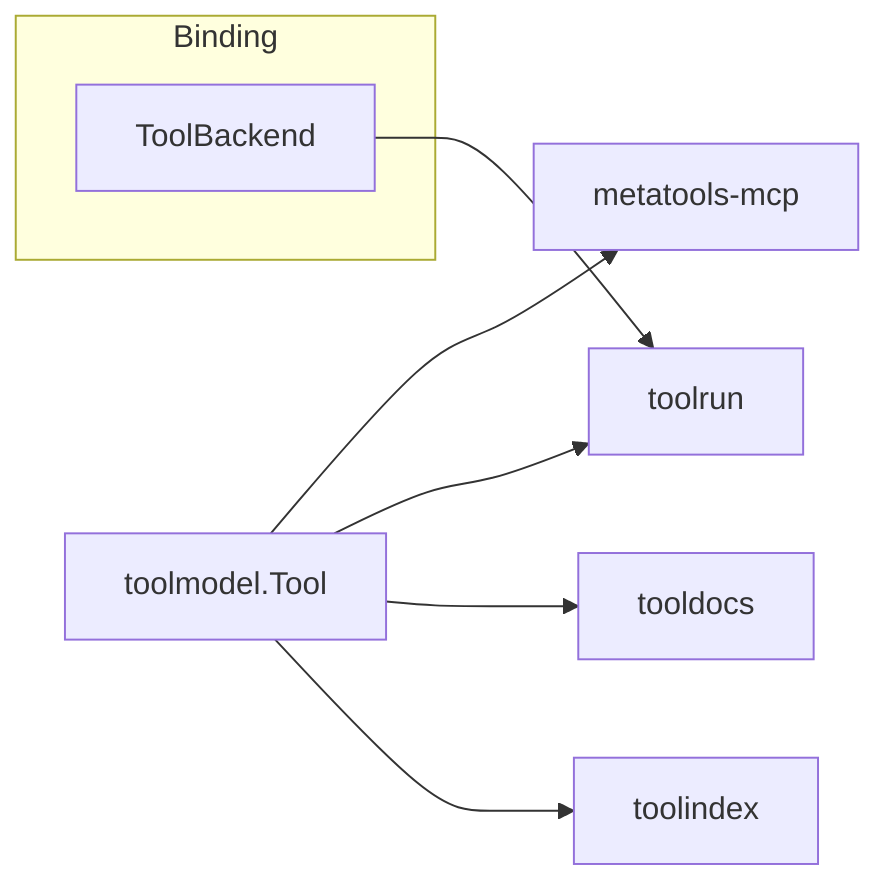

# Architecture

`toolmodel` sits at the bottom of the stack. Everything else consumes its types.

## Key decisions

- Embeds the official MCP Go SDK `mcp.Tool` for 1:1 protocol alignment.
- Adds `Namespace`, `Version`, and `Tags` without altering MCP semantics.
- Keeps validation local and dependency-light (`jsonschema-go`).
