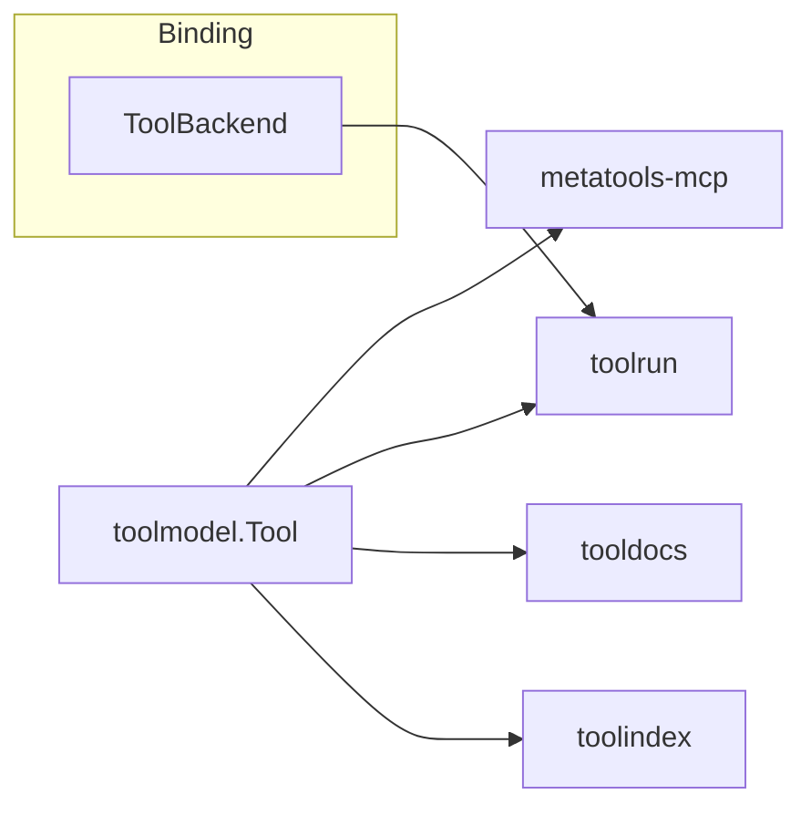
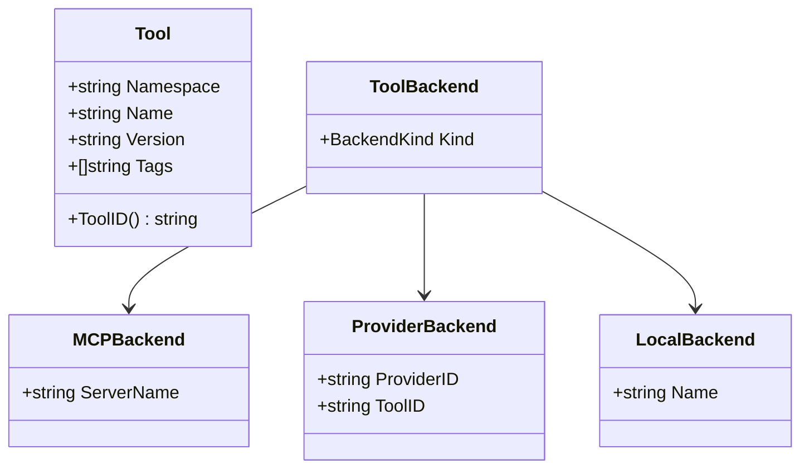
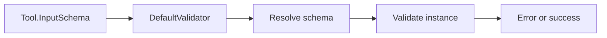

# Architecture

`toolmodel` sits at the bottom of the stack. Everything else consumes its types
and uses it as the canonical source of truth.

## Component view

## Data model view

## Validation pipeline

## Design notes

- Embeds `mcp.Tool` to stay aligned with the official MCP SDK.
- Adds `Namespace`, `Version`, and `Tags` without altering MCP semantics.
- Keeps validation dependency-light and deterministic.
