# User Journey

This journey shows how a tool definition flows from authoring to execution across the stack, with `toolmodel` as the source of truth.

## End-to-end flow (stack view)

```mermaid
%%{init: {'theme': 'base', 'themeVariables': {'primaryColor': '#718096', 'primaryTextColor': '#fff'}}}%%
flowchart TB
    subgraph author["Tool Authoring"]
        Define["📝 Define Tool<br/><small>toolmodel.Tool</small>"]
        Schema["📐 InputSchema<br/><small>JSON Schema 2020-12</small>"]
    end

    subgraph validation["Validation"]
        Validate["✅ Tool.Validate()"]
        SchemaVal["✅ SchemaValidator"]
    end

    subgraph registration["Registration"]
        Register["📇 toolindex.RegisterTool()"]
        Backend["⚙️ ToolBackend<br/><small>local | provider | mcp</small>"]
    end

    subgraph discovery["Discovery"]
        Search["🔍 search_tools"]
        Summary["📋 Summary<br/><small>ID, Name, Tags</small>"]
    end

    subgraph execution["Execution"]
        Describe["📚 describe_tool"]
        Run["▶️ run_tool"]
    end

    Define --> Schema --> Validate
    Validate --> SchemaVal --> Register
    Register --> Backend
    Backend --> Search --> Summary
    Summary --> Describe --> Run

    style author fill:#718096,stroke:#4a5568,stroke-width:2px
    style validation fill:#38a169,stroke:#276749
    style registration fill:#3182ce,stroke:#2c5282
    style discovery fill:#d69e2e,stroke:#b7791f
    style execution fill:#6b46c1,stroke:#553c9a
```




## Step-by-step

1. **Author defines a tool** using `toolmodel.Tool` with an MCP-compatible schema.
2. **Tool is validated** (`Tool.Validate()` + optional schema validation).
3. **Tool is registered** into `toolindex` with a backend binding.
4. **Agent discovers** tools via `search_tools` (powered by `toolindex`).
5. **Agent inspects schema/docs** via `describe_tool` (powered by `tooldocs`).
6. **Agent executes** the tool via `run_tool` (powered by `toolrun`).

## Example: define a tool

```go
import (
  "encoding/json"
  "github.com/jonwraymond/toolmodel"
  "github.com/modelcontextprotocol/go-sdk/mcp"
)

inputSchema := json.RawMessage(`{
  "type": "object",
  "properties": {
    "owner": {"type": "string"},
    "repo": {"type": "string"}
  },
  "required": ["owner", "repo"]
}`)

repoTool := toolmodel.Tool{
  Tool: mcp.Tool{
    Name:        "get_repo",
    Title:       "Get repo details",
    Description: "Fetch repository metadata.",
    InputSchema: inputSchema,
  },
  Namespace: "github",
  Tags:      []string{"repo", "git", "metadata"},
}

if err := repoTool.Validate(); err != nil {
  // handle invalid tool
}
```

## Expected outcomes

- A **stable tool ID** (`github:get_repo`) that downstream components can resolve.
- **Schema-driven validation** for inputs and outputs (via `SchemaValidator`).
- **Token-efficient discovery** by pushing only summaries into search results.

## Common failure modes

- **Invalid tool ID:** `ErrInvalidToolID` when parsing malformed IDs.
- **Invalid tool fields:** `ErrInvalidTool` when name is missing/invalid or input schema is nil.
- **Unsupported schema dialect:** `ErrUnsupportedSchema` for non-2020-12/draft-07 schemas.
- **External refs blocked:** `ErrExternalRef` if the schema attempts external `$ref`.

## Why this matters

`toolmodel` keeps the entire stack aligned with the official MCP tool shape while still providing namespaces, versions, and tags needed for real-world registries.
